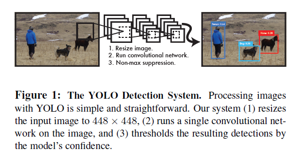
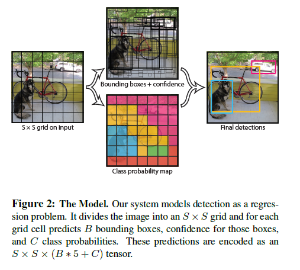
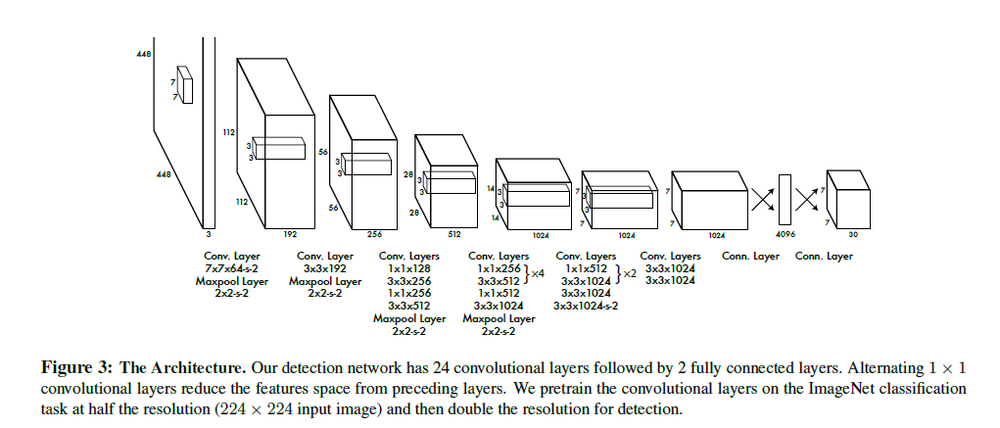
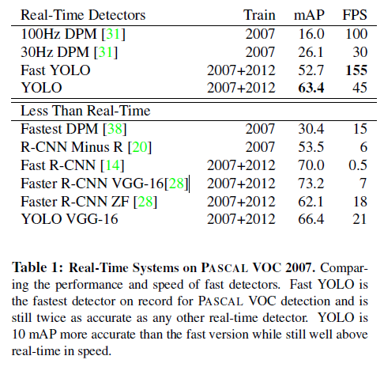
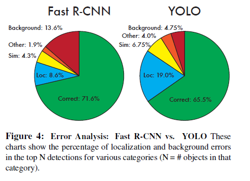
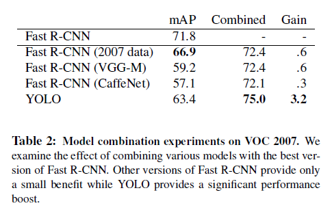
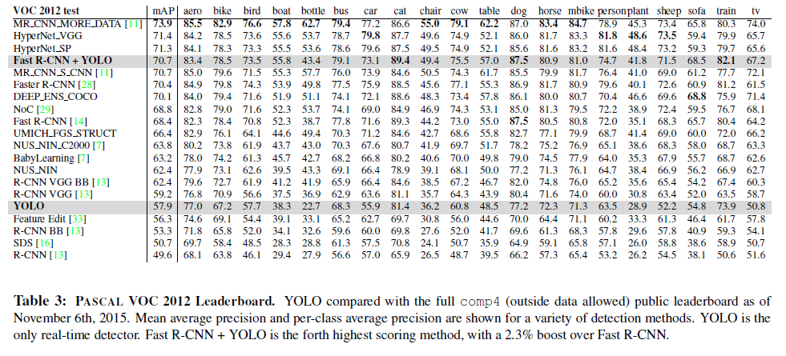
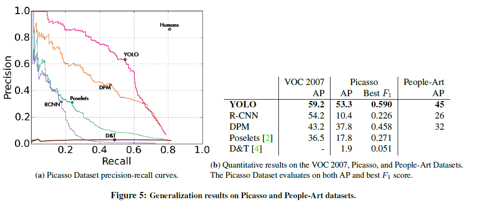
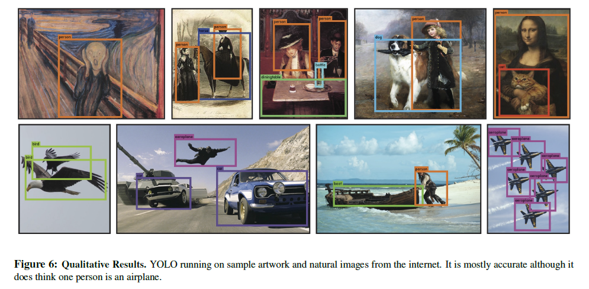

### 
You Only Look Once：Unified, Real-Time Object Detection

本文发表于2016CVPR，累计引用量达126。本文主要是提出了一种通用目标检测方法YOLO，突破了目标检测问题中速度这一难题。

##### 
$Joseph\ Redmon^{1}$, $Santosh\ Divvala^2$,$Ross\ Girshick^3$,$Ali\ Farhadi^4$

>[1] Joseph Redmon: 华盛顿大学CSE博士生
>
>[2] Santosh Divvala:AI2的研究科学家，与Ali Farhadi和Carlos Guestrin在华盛顿大学有合作。在卡内基梅隆大学机器人学专业获得博士学位，现主要研究方向为图像理解。
>
>[3] Ross Girshick:Facebook AI Research 研究科学家，现研究方向为visual perception、visual reasoning。
>
>[4] Ali Farhadi:华盛顿大学CSE专业副教授

#### 摘要：

　　我们提出了YOLO，一种目标检测的新方法。先前的目标检测的工作使用分类器来进行检测。然而，我们将目标检测视为回归问题以在空间上分离边界框和相关类概率。在一次评估中使用单一的神经网络来直接从整幅图像中预测边界框和类概率。因为整个检测pipeline是一个单一网络，所以可以直接在检测性能上进行端到端优化。

　　我们统一的结构十分迅速。我们基础的YOLO模型实时处理图像达到了45帧/s的速度。一个该网络更小的版本，Fast YOLO,每秒处理155帧并且平均精度是其他实时检测器的两倍。与最好的检测系统相比，YOLO会出现更多的定位误差，但很少会预测背景虚警。最后，YOLO学习物体十分通用的表示。当从自然图像推广到其他领域（如艺术作品）时，它优于其他的检测方法，包括DPM和R-CNN。

【摘要部分】：介绍了一个目标检测方法YOLO(Fast YOLO)。创新点是其将目标检测问题视为回归问题，并使用单一神经网络来直接预测整幅图像，从而提高了处理速度，达到实时的效果。同时，YOLO还在艺术作品上有更好的泛化效果。

#### 1. 简介

　　人类看一眼图片就立刻知道该图片中有哪些物体，在什么位置以及他们之间的关系。人类的视觉系统十分迅速并准确，使得我们可以执行复杂的任务，例如无意识的驾驶。快速，准确的目标检测算法可以使计算机不使用专门的传感器来驾驶汽车，使辅助的设备可以向用户提供实时的场景信息以及解锁通用目的，响应型机器人系统的可能性。

　　目前的检测系统使用分类器来进行检测。为了检测一个物体，这些系统使用一个该物体的分类器并在测试图像中以多个位置和尺度进行评估。例如DPM系统使用滑窗法，其中分类器在整个图像上均匀间隔的运行。

　　更近的方法如R-CNN使用区域提案方法首先生成图像中可能的边界框然后在提案框中运行分类器。分类之后，后处理用于调整边界框，消除重复检测并基于场景中其他物体对边界框进行重评分。这些复杂的方法很缓慢并且因为每个独立的部件都需要分别徐连而难以优化。

简介前一部分首先介绍了人类视觉系统的特点，引出快速准确的目标检测算法的重要性。接着分析了之前目标检测系统（DPM、R-CNN）

　　我们将物体检测重新视为简单回归问题，直接从图片像素中获得边界框坐标和类别概率。使用我们的系统，你仅使用一次图像来预测图片中有什么物体以及他们的位置。

【You Only Look Once】意思即为只使用图片一次就可以进行预测

　　YOLO很简单：见图1.一个卷积网络同时预测多个边界框以及这些框的类别概率。YOLO使用整幅图像进行训练并直接优化检测性能。这种统一的模型比传统的物体检测方法有一些优势。

　　首先，YOLO十分快。因为我们将检测视为回归问题所以我们不需要复杂的pipeline。我们只是简单的在测试时使用一幅新图像来运行我们的神经网络以预测检测结果。我们基础的网络在无批处理的情况下可以在Titan X GPU上以45帧每秒的速度运行，而一个更快的版本速度超过150fps。这意味着我们可以以不到25毫秒的延迟实时的处理视频流。此外，YOLO在平均精度上达到了其他实时系统的两倍。一个在网络摄像头上实时运行的例子请参见我们的项目网址：<http://pjreddie.com/yolo/>.

　　第二点，YOLO在预测时了解全局图像。不像滑窗法和基于区域提案的技术，YOLO在训练和测试时使用整幅图像因此它隐含的编码了关于类别以及其外观的上下文信息。Fast R-CNN,一种最好的检测方法，错误的把图像的背景识别为物体因为它看不到更大的上下文。YOLO产生的背景误差比Fast R-CNN产生的一般还要少。

　　第三点，YOLO学习目标可泛化的表示。当使用自然图像训练使用艺术作品测试时，YOLO大幅优于最好的检测方法例如DPM和R-CNN。因为YOLO具有很强的泛化能力，所以在应用与其他领域或使用不太期望的输入时依然不容易失败。

　　YOLO在准确率上还落后于最好的检测系统。虽然它可以快速的识别图像中的物体，但他在准确定位一些物体时还显得不足，特别是小物体。我们会在实验中进一步研究这些权衡。

【简介这一部分】介绍了YOLO的三个特点：快速、全局、泛化，同时也指出了YOLO的不足，即准确率（定位）较低。

　　我们所有的训练测试代码都是开源的。各种预训练的模型也可以下载。

#### 2. 统一检测

　　我们将目标检测分散的组件统一成一个单一神经网络。我们的网络使用从整幅图中提取的特征来预测每个边界框。它也同时预测所有边界框的类别。这意味着我们的网络了解了整幅图像的全局信息以及所有的图像中的目标。YOLO的设计使其可以端到端训练并可以在实时检测的同时维持很高的平均精度。

　　我们的系统将输入图像分成 *S x S* 的网格。如果目标的中心落入一个网格单元，该网格单元就负责检测该目标。

　　每个网格单元预测 *B*  边界框以及这些框的置信度。这些置信度反映了模型对框中包含目标的自信程度以及他对所预测的框有多少的准确度。形式上我们定义置信度为$Pr（Object）*IOU^{truth}_{pred} $。如果该单元中没有目标，置信度则为零。否则我们希望置信度等于预测框与ground truth的IOU。

　　每个边界框包含五个预测值：*x, y, w, h* 以及置信度。(x,y)坐标表示相对于网格单元边界框的中心。宽和高是相对于整个图像而预测的。最后置信度预测表示了预测框和任一ground truth框的IOU。

　　每个网格单元也预测了 *C*  条件类别概率，$Pr(Class_i|Object)$。这些概率适用于包含物体的网格单元。我们只预测每个网格单元的一组类别概率，而不管边界框的数量。

　　在测试时，我们将条件类别概率和单个框预测置信度相乘，
$$
Pr(Class_i|Object) * Pr(Object) * IOU^{truth}_{pred} = Pr(Class_i) * IOU^{truth}_{pred}        (1)
$$
 这给了我们每个框特定类别的置信度。这些分数表示出现在框中的类的概率以及预测框对目标的适应程度。

　　在评估YOLO在PASCAL VOC上结果时，我们使用了S=7，B=2.PASCAL VOC有20种标注的类别所以C=20。我们最终的结果是一个7x7x30的张量。

【这一部分】简要介绍了YOLO 的结构以及运作机制，见图2。

##### 2.1 网络设计

　　我们使用卷积神经网络来实现此模型并在PASCAL VOC检测数据集上进行了评估。初始卷积层从图像中提取特征而全连接层预测输出概率以及坐标。

　　我们网络的结构受到了GoogLeNet图像分类模型的启发。我们的网络有24个卷积层，紧接着是2个全连接层。我们没有使用GoogLeNet中的inception 模块，而是简单的使用了1x1降维层紧接着3x3卷积层，类似于Lin等人[22]。整个网络如图3。

　　我们也训练了一个YOLO快速版本意在突破快速物体检测的限制。Fast YOLO使用了更少卷积层的网络（9层而不是24层）每层更少的过滤器。除了网络的大小，所有训练和测试的参数都和YOLO的一样。

##### 2.2 训练

　　我们在ImageNet 1000类竞赛数据集上预训练了我们的卷积层。在预训练中我们使用了前20个卷积层紧跟着一个平均池化层及一个全连接层。我们花了大约一个星期训练该网络并在ImageNet 2012验证集上达到了单一结果前五，准确率88%的结果，相比于Caffe’s Model Zoo中GoogLeNet模型。我们使用了Darknet框架来训练和推导。

　　之后我们使用该模型进行检测。Ren等表明在预训练网络中添加卷积层和连接层可以提高性能。跟随他们的例子，我们添加了4个卷积层和2个全连接层并随机初始化了权重。检测通常需要有细密纹理的视觉信息所以我们把输入图像的分辨率从224x224提升到了448x448。

　　我们最后一层预测了类别概率和边界框坐标。我们通过图像的宽高来归一化边界框的宽高，使其落入0到1内。我们将边界框的x和y参数化为特定网格单元位置的偏移量来使其也在0到1间。

　　在最后一层我们使用了一个线性激活函数而所有其他层使用如下leaky rectified 线性激活：
$$
\phi(x) = \{^{x, 　　　if 　x>0}_{0.1x,     　otherwise} 　　　　　　(2)
$$
　　我们在模型的输出上优化平方和误差。我们使用平方和误差因为其易于优化，但他并不完全符合我们最大化平均精度的目标。它视定位误差和分类误差同等重要，这可能不太理想。此外，每幅图中有许多网格单元没有包含任何物体。这使那些单元的置信度趋于零，通常会压过那些包含物体的单元的梯度。这可能会导致模型不稳定，训练在早期发散。

　　为了补救该问题，我们提高了边界框坐标预测的损失而降低了不包含物体的边界框置信度预测的损失。我们使用两个参数$\lambda_{coord}$和$\lambda_{noobj}$来完成。我们设置$\lambda_{coord}=5$，$\lambda_{noobj}=0.5$。

　　平方和误差也将大边界框误差和小边界框误差视为等同。我们的误差度量应该反映出大边界框中的小误差比小边界框中的重要程度要小。为了部分的解决该问题我们预测了边界框宽和高的平方根而不是直接预测宽和高。

　　YOLO预测每个网格单元的多个边界框。在训练时我们只希望一个边界框预测器来负责每个目标。我们基于当前与groundtruth有最高IOU的预测来赋予某个预测器负责预测一个目标。这致使边界框预测器之间的专门化。每个预测器在预测特定大小，长宽比或物体类别时获得更好的结果，提升了整体召回率。

　　在训练时，我们优化如下多部分损失函数：
$$
\begin{split}
\lambda_{coord}&\sum^{S^{2}}_{ i=0}\sum^{B}_{j=0}\mathbb{I}^{obj}_{ij}[(x_i-\hat{x}_i)^{2}+(y_i-\hat{y_i})^{2}]\\+&\lambda_{coord}\sum^{S^{2}}_{i=0}\sum^{B}_{j=0}\mathbb{I}^{obj}_{ij}[(\sqrt{w_i}-\sqrt{\hat{w_i}})^2+(\sqrt{h_i}-\sqrt{\hat{h_i}})^2]\\&+\sum^{s^2}_{i=0}\sum^B_{j=0}\mathbb{I}^{noobj}_{ij}(C_i-\hat{C_i})^2\\&+\lambda_{noobj}\sum^{S^2}_{i=0}\sum^{B}_{j=0}\mathbb{I}^{obj}_{ij}(C_i-\hat{C_i})^2\\&+\sum^{S^2}_{i=0}\mathbb{I}^{obj}_i\sum_{c\in classes}(p_i(c)-\hat{p}_i(c))^2　　　　　　　　　　(3)
\end{split}
$$
其中$\mathbb{I}^{obj}_i$表示物体是否在网格单元 $\mathit{i}$ 中出现，$\mathbb{I}^{obj}_{ij}$表示在网格单元 $\mathit{i}$ 中第 $\mathit{j}$ 个边界框预测器负责该预测。

　　注意到损失函数在物体出现在该网格单元时只惩罚分类误差（因此条件概率更糟的被讨论）。损失函数也只会惩罚边界框坐标误差当该预测器负责groundtruth框时（例如，和该网格单元中任何预测器都有最高的IOU）。

　　我们在PASCAL VOC2007、2012的训练集和测试集上训练量网络大约135个时期【补充】（一个时期(epochs) = 所有训练样本的一个正向传递和一个反向传递）。当在2012上测试时，我们也使用了VOC 2007测试数据来训练。整个训练过程中我们使用64的批尺寸，0.9的momentum和0.0005的decay。

　　我们的学习率安排如下：第一个时期我们慢慢的将学习率从$10^{-3}$提升至$10^{-2}$。如果我们以一个高学习率开始，我们的模型经常由于梯度不稳定而发散。我们接着使用${10^{-2}}$运行75个时期，然后使用$10^{-3}$运行30个时期，最后使用$10^{-4}$运行30个时期。

　　为了避免过拟合我们使用了dropout和广泛的数据增强。在第一个连接层后我们使用dropout率为0.5的droupout层来防止各层之间的共同适应。对于数据增强我们采用了最高原始图像20%尺寸的随机缩放及平移。我们也在HSV颜色空间中以最高1.5的因子随机的调整图像的曝光度和饱和度。

##### 2.3 推断

　　就像在训练时一样，为测试图像预测检测结果只需要一次网络评估。在PASCAL VOC 中网络在每张图预测了98个边界框以及为每个框预测了类别概率。YOLO在测试时非常快因为其只需要一次简单网络评估，不像基于分类的方法。

　　网格设计实现了边界框预测的空间多样性。通常哪个网格单元包含物体是明确的并且网络对于每个物体只预测一个框。但是，一些大物体或多个网格单元边界旁的物体可以被多个网格单元很好的定位。可以使用非极大值抑制来解决这些多重检测。虽然非极大值抑制对R-CNN或DPM性能影响不重要，但在平均精度上增加了23%。

##### 2.4 YOLO的限制

　　YOLO对边界框预测实施强空间约束因为每个网格单元只预测两个框并只能有一个类别。这种空间约束限制了模型可预测的附近物体的数量。我们的模型对成组的小目标表现不佳，例如一群鸟。

　　由于我们的模型从数据中学习预测边界框，它在对新的或不寻常的宽高比或配置的物体的泛化上就比较困难。我们的模型也使用相对粗糙的特征来预测边界框因为我们的结构有多个从输入图像的降采样层。

【降采样】（downsampling）：即是采样点数减少。对于一幅N*M的图像来说，如果降采样系数为k,则即是在原图中 **每行每列**每隔k个点取一个点组成一幅图像。降采样很容易实现. 

　　最后，虽然我们在一个近似检测性能的损失函数上训练，我们的损失函数对待小边界框误差与大边界框误差一致。一个大框中的小误差一般是良性的但小框中的小误差对IOU有较大影响。我们主要的误差来源于定位。

【第二部分思路】主要是详细的介绍了YOLO的实现细节以及YOLO方法的不足之处，论文从**网络结构**、**训练**两部分介绍了如何构建该神经网络（包括结构、作用、预训练、激活函数、学习率等细节）。接着介绍了YOLO的限制，如空间约束导致的小目标检测不佳，宽高比泛化不佳、定位误差等问题。

#### 3. 与其他检测系统的比较

　　目标检测是计算机视觉的核心问题。检测pipeline通常先从输入图像中提取一系列鲁棒特征。接着使用分类器或定位器来在特征空间中辨别物体。这些分类器或定位器要么是在整幅图上使用滑窗的方式运行，要么实在图像上一些区域的子集中运行。我们比较了YOLO检测系统与一些最好的监测框架，列出重点的相似性与区别。

　　**可变形部件模型  **可变形部件模型使用滑窗法来检测物体。DPM使用一种disjoint pipeline来提取静态特征，分类区域，为高分区域预测边界框等。我们的系统使用一个单一卷积神经网络来替代所有这些分离的部分。该网络同时执行所有特征提取，边界框预测，非极大值抑制以及上下文推理。该网络训练内置的特征并为检测任务优化他们，而不是使用静态特征。我们统一的结构促成了一个比DPM更快速，更准确的模型。

　　**R-CNN  **R-CNN和它的变体使用区域提案而不是滑窗来检测图像中的物体。Selective Search生成可能的边界框，卷积神经网络来提取特征，一个SVM来为框打分，一个线性模型来调整边界框以及非极大值抑制消除重复的检测。该pipeline的每个阶段都必须独立的精确调整所以导致系统很慢，在测试时每张图需要40多秒。

　　YOLO和R-CNN有一些相似性。每个网格单元提出可能的边界框并使用卷积特征为那些框打分。但是，我们的系统在网格单元提案上增加了空间约束以减轻同一物体的重复检测。我们的系统提出更少的边界框，相比于Selective Search大约2000个，我们的系统每张图只提取98个。最后，我们的系统将那些单独的组件组合成一个单一的，联合优化过的模型。

　　**其他快速检测器  **Fast和Faster R-CNN专注于使用共享计算和使用神经网络来提案区域（而不是Selective Search）来加速R-CNN框架。虽然他们提供了对R-CNN速度和准确度的提升，这两种方法依然不符合实时的性能。

　　许多研究专注于加速DPM pipeline。他们加速HOG计算，使用级联并将计算放入GPU。但是，DPM在实时运行是只有30HZ。

　　YOLO完全抛弃pipeline而不是尝试优化大型检测流水线中单独的组件，并且这样设计的很快。

　　单一类别的检测器如人脸或人可以被很好的优化因为他们处理的变形更少。YOLO是一个学习同时检测多种目标的通用检测器。

　　**Deep MultiBox  **不像R-CNN，Szegedy等训练了一个卷积神经网络来预测ROI而不是使用Selective Search。MultiBox也可以通过将置信度预测替换为单类预测来执行单物体检测。但是，MultiBox不能执行通用物体检测并依然只是大型检测流水线中的一部分，需要进一步的图像补丁分类。YOLO和MultiBox都使用卷积神经网络来预测边界框但YOLO是一个完整的检测系统。

　　**OverFeat  **Sermanet等训练了一个卷积神经网络来执行定位并且修改该定位器使其执行检测。OverFeat高效的执行滑窗检测但它依然是一个非联合系统。OverFeat优化了定位而不是检测性能。如DPM，定位器在做预测时只能看到局部信息。OverFeat不能推出全局上下文因此需要重要的后处理来产生一致的检测。

　　**MultiGrasp  **我们的工作设计类似于Redmon等grasp检测的工作。我们边界框预测的网格方法是基于用来回归grasps的MultiGrasp系统。但是，grasp检测是比目标检测简单得多的任务。MultiGrasp只需要为包含一个物体的图片预测一个单一graspable 区域。它不需要估计物体的尺寸、位置或边界或预测它的类别，只是寻找一个适合grasping的区域。YOLO同时预测一张图片中多个类别的多个目标的边界框以及类别概率。

【第三部分思路】主要比较了YOLO与其他一些监测系统。首先比较了**DPM**、**R-CNN**，这两个检测系统在前文就有介绍。接着又比较了其他快速检测器如**Deep MultiBox**、**OverFeat**、**MultiGrasp**等。

#### 4. 实验

　　首先我们在PASCAL VOC 2007上比较了YOLO和其他实时检测器。为了理解YOLO和R-CNN变体的区别，我们研究了在VOC 2007上YOLO和Fast R-CNN（R-CNN性能最好的版本之一）产生的误差。基于不同的误差情况我们展示了YOLO可以用来对Fast R-CNN的检测重打分并且减少了背景虚警，给出了性能上重大的提升。我们也给出了在VOC 2012的结果并与当前最好的方法比较了mAP。最后我们表明了YOLO比其他检测器更好的泛化到艺术作品数据集上。

【5个实验】：

1 PASCAL VOC 2007 上的检测结果

2 VOC 2007上YOLO及Fast R-CNN的误差分析

　　\>YOLO定位误差占据大部分，比Fast R-CNN产生更少的背景虚警。

3 Fast R-CNN与YOLO 的结合

4 VOC 2012上的结果

5 在艺术作品数据集上的结果

　　\> R-CNN在自然图像上平均精度较高，但在艺术作品数据集上性能大幅下降；YOLO维持了平均精度，具有较好的泛化能力；DPM平均精度变化也不大，但初始值较低。

##### 4.1 与其它实时系统的比较

　　许多致力于物体检测的研究专注于快速产生标准检测流水线。但是，只有Sadeghi等真正产生了一个实时运行的检测系统（每秒30帧以上）。我们比较了YOLO和他们DPM的GPU实现（以30HZ或100HZ运行）。虽然其他的研究没有达到实时的标准，我们也比较了他们相对mAP以及速度来检验物体检测系统中可用的准确度-性能权衡。

　　Fast YOLO是PASCAL上最快的物体检测方法；据我们所知，它是现存最快的物体检测器。52.7%的mAP比之前实时检测工作在准确度上高出两倍。YOLO把mAP提升至63.4%的同时保持了实时的性能。

　　我们也使用VGG-16训练了YOLO。该模型更准确但也比YOLO慢很多。和其他使用VGG-16的系统进行比较是十分有用的但是因为它比实时要慢所以本文其余部分专注于我们快速的模型。

　　Fastest DPM高效的提速了DPM而没有牺牲太多的mAP但是缺失实时性能的两倍。它也受限于DPM相较于神经网络方法较低的检测准确率。

　　R-CNN minus R将Selective Search替换为静态边界框提案。虽然这比R-CNN快很多，但也没有达到实时的标准并且由于没有很好的提案所以准确率也不高。

　　Fast R-CNN提速了R-CNN分类的阶段但依然依赖于selective search（每张图花两秒来生成边界框提案）。因此它有高mAP但以0.5fps的速度依然距离实时很远。

　　最近的Faster R-CNN使用神经网络替换了selective search来提案边界框，与Szegedy等相似。在我们的测试中他们最准确的模型达到了7fps而一个更小，不太准确的模型达到了18fps。Faster R-CNN的VGG-16版本高出10Map但比YOLO慢了六倍。Zeiler-Fergus Faster R-CNN只比YOLO慢2.5倍但也没那么准确。

##### 4.2 VOC 2007误差分析

　　为了更进一步检验YOLO和最好的检测器之间的区别，我们详细研究了VOC 2007上的失败结果。我们将YOLO和Fast R-CNN进行比较因为Fast R-CNN是PASCAL上表现最好的检测器之一并且其检测结果是公开可用的。

　　我们使用了Hoiem等的方法和工具。在测试时每个类别我们看最高的N个预测结果。每个检测结果要么是正确的要么它被分为某一类误差：

- 正确：正确的类别并且IOU>0.5

- 定位：正确的类别，0.1<IOU<0.5

- 相似：类别相似，IOU>0.1

- 其他：类别错误，IOU>0.1

- 背景：与任何物体IOU<0.1

  图4展示了所有20个类别中平均每个错误类型的细分。

  

  

  

  　　YOLO在正确定位目标上表现不佳。定位误差占的YOLO误差比例比其他所有来源加起来还要多。Fast R-CNN会产生更少的定位误差但有更多的背景误差。其最好的检测中有13.6%的是不包含任何物体的虚警。Fast R-CNN比YOLO预测背景要高出三倍。

  ##### 4.3 组合 Fast R-CNN 和YOLO

  　　YOLO比Fast R-CNN产生更少的背景误差。通过使用YOLO来消除Fast R-CNN产生的背景检测我们可以在性能上有重大的提升。对每个R-CNN预测的边界框我们会检查是否YOLO会预测相似的框。如果是，我们会基于YOLO预测的概率以及两个框的重叠对该检测一个提升。

  　　最好的Fast R-CNN模型在VOC 2007测试集上达到了71.8%的mAP。当与YOLO结合后，它的mAP提升了3.2%，到达了75%。我们也尝试将最好的Fast R-CNN模型与一些其他版本的Fast R-CNN组合。这些集成只在mAP上产生了0.3到0.6%的小提升，详情见表2。

  

  

  

  　　从YOLO中的提升不是简单模型集成的副产品因为当与不同版本Fast R-CNN组合时只有很少的提升。相反，它很精确是因为YOLO在测试时会产生不同类别的错误，这些对提升Fast R-CNN性能很有效。

  　　不幸的是，这种组合并没有从YOLO的速度中受益因为我们分别的运行每个模型然后组合的结果。但是，因为YOLO很快，这相比于Fast R-CNN并不会增加任何重大的计算时间。

  ##### 4.4 VOC 2012结果

  　　在VOC 2012 测试集上，YOLO达到了57.9% mAP。这比目前最好的方法要低，接近于使用VGG-16的原始R-CNN，见表3。我们的系统相比于与其最接近的检测器在小物体上做的不好。在类似瓶子，绵羊以及电视/显示器的类别上YOLO的得分比R-CNN或Feature Edit低了8-10%。但是，在其他类别例如猫和火车YOLO达到了更好的表现。

  

  

  

  　　我们组合了Fast R-CNN+YOLO的模型是性能最好的检测方法之一。Fast R-CNN从与YOLO的组合中获得了2.3%的提升，在公开排行榜上提升了5个点。

  ##### 4.5 泛化能力：艺术作品中的人物检测

  　　学术的物体检测数据集以相同的分布提取训练和测试数据。在现实生活应用中很难预测所有可能的使用情况并且测试数据会与检测系统之前看到的数据有所偏差。我们在Picasso数据集及the People-Art数据集（两个用于测试艺术作品中任务检测的数据集）上将YOLO与其他检测系统进行比较。

  　　图5展示了YOLO和其他检测方法的性能比较。为了进行参考，我们给出了所有仅使用VOC 2007数据训练的模型在人物上的平均精度。在Picasso中模型是在VOC 2012上训练的而在People-Art中模型是在VOC 2010上训练的。

  

  

  

  　　R-CNN在VOC 2007上有很高的平均精度。但是R-CNN应用于艺术作品时大幅下降。R-CNN使用Selective Search来提案为自然图像调优的边界框。在R-CNN中分类步骤时是看见很小的区域并且需要很好的提案。

  　　DPM当应用于艺术作品时很好的维持了它的平均精度。之前的工作推论了DPM表现很好是因为它有很强的物体形状及布局的空间模型。尽管DPM没有像R-CNN那样下降那么多，但它开始时只有很低的平均精度。

  　　YOLO在VOC 2007上表现很好并且当应用于艺术作品时平均精度比其他方法下降的少。就像DPM一样，YOLO对物体的尺寸和形状以及物体间的关系和物体通常出现的位置建模。艺术作品和自然图像在像素上有很大区别但他们在物体尺寸和形状上十分相似，因此YOLO依然可以预测很好的边界框和检测结果。

  

  

  

  

  #### 5. 野外实时检测

  　　YOLO是一个快速准确的目标检测器，使其对于计算机视觉应用很理想。我们将YOLO与一个网络摄像头连接并验证它保持实时性能，包括从摄像头获取图像以及展示检测结果的时间。

  　　所产生的系统时交互的和engaging。虽然YOLO单独的处理图像，但当附加摄像头后它表现的像一个追踪系统，当物体移动或外表改变时都可以检测。该系统demo和源代码可以在我们的项目网站上找到：<http://pjreddie.com/yolo/>。

  #### 6. 结论

  　　我们介绍了YOLO，一个统一的目标检测模型。我们的模型很容易被构造并且可以直接在整幅图像上训练。不像基于分类的方法，YOLO是在一个直接与检测性能一致的损失函数上训练的并且整个模型被联合的训练。

  　　Fast YOLO是文献中最快的通用目标检测器，YOLO也在实时物体检测上推进了最好的方法。YOLO在新领域上泛化的也很好，这使它对于快速，鲁棒的物体检测应用十分理想。